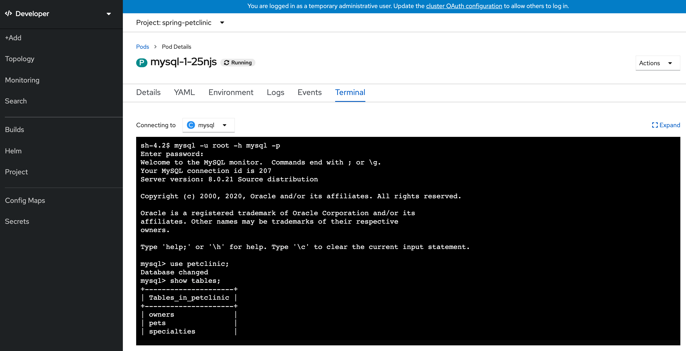
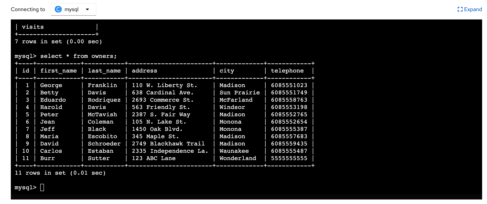

# Spring Pet Clinic and OpenShift

## Localhost Development

```
mvn package

docker-compose up

java -Dspring.profiles.active=mysql -jar target/spring-petclinic-2.3.0.BUILD-SNAPSHOT.jar 

docker exec -it spring-petclinic_mysql_1 mysql -upetclinic -ppetclinic

show databases;
use petclinic;
show tables;

+---------------------+
| Tables_in_petclinic |
+---------------------+
| owners              |
| pets                |
| specialties         |
| types               |
| vet_specialties     |
| vets                |
| visits              |
+---------------------+
7 rows in set (0.00 sec)

select * from petclinic.owners;
+----+------------+-----------+-----------------------+-------------+------------+
| id | first_name | last_name | address               | city        | telephone  |
+----+------------+-----------+-----------------------+-------------+------------+
|  1 | George     | Franklin  | 110 W. Liberty St.    | Madison     | 6085551023 |
|  2 | Betty      | Davis     | 638 Cardinal Ave.     | Sun Prairie | 6085551749 |
|  3 | Eduardo    | Rodriquez | 2693 Commerce St.     | McFarland   | 6085558763 |
|  4 | Harold     | Davis     | 563 Friendly St.      | Windsor     | 6085553198 |
|  5 | Peter      | McTavish  | 2387 S. Fair Way      | Madison     | 6085552765 |
|  6 | Jean       | Coleman   | 105 N. Lake St.       | Monona      | 6085552654 |
|  7 | Jeff       | Black     | 1450 Oak Blvd.        | Monona      | 6085555387 |
|  8 | Maria      | Escobito  | 345 Maple St.         | Madison     | 6085557683 |
|  9 | David      | Schroeder | 2749 Blackhawk Trail  | Madison     | 6085559435 |
| 10 | Carlos     | Estaban   | 2335 Independence La. | Waunakee    | 6085555487 |
| 11 | Burr       | Sutter    | 123 ABC Lane          | Wonderland  | 5555555555 |
+----+------------+-----------+-----------------------+-------------+------------+
11 rows in set (0.00 sec)


open http://localhost:8080

```

The GUI results with "Burr" as an owner when connected to MySQL


## OpenShift

Create a new OpenShift `Project` with `spring-petclinic` name.


### Dev Console

Then move to Developer perspective:


And create a new MySQL instance by clicking the `+Add` button and choosing the `Database` option:


Choose MySQL Ephemeral:


and Click `Instantiate Template`.

Then fill the wizard with the following parameters:


Click the `Create` button. 

### Deploy Pet Clinic App


Click the `+Add` button and choose `From Git` type:

Fill the git repo with the following value `https://github.com/burrsutter/spring-petclinic` and select the project as Java project:


Click the `Build Configuration` link:


Add the following environment variables:

```
SPRING_PROFILES_ACTIVE=mysql
MYSQL_URL=jdbc:mysql://mysql:3306/petclinic
```


Finally click the `Create` button and wait until the Build is done and the Pod is up and running (dark blue around the deployment bubble).
Then push the Open URL button to view the Pet Clinic app:


And if you visit the MySQL deployment's Terminal then you connect to the database to see the schema and data


```
mysql -u root -h mysql -p

petclinic

use petclinic;
show tables;
```



```
select * from owners;
```


